- We tend to recommend [PyGame Zero](https://pygame-zero.readthedocs.io/en/stable/index.html)
- One of the harder problems is people being able to adapt their mental model of Scratch blocks to abstract programming concepts
- The way I tend to put it is:
	- What does this thing do?
	- How does it do it? - Step by Step
	- How can we make it do that ourselves?
### Demonstrate structural similarities
#### Loops
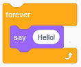

```python
while True:
    print("Hello!")
```
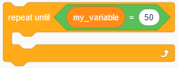
```python
while my_variable != 50:
	# Do Stuff
```
> [!info] Tips
> - Remember to write the colon in `while <condition>:`
> - The indentation on the second line (indented by 4 spaces) shows that `print("Hello!")` is a part of the loop
#### Conditionals
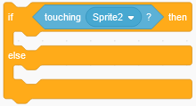
```python
if Sprite1.colliderect(Sprite2):
    # Do Stuff
else:
	# Do Other Stuff
```
> [!info] Tips
> - Remember to write the colon after the condition in the `if condition:` part.
> - Everything inside the `if` and `else` blocks needs to be indented.
#### Actors
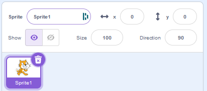

```python
Sprite1 = Actor('cat')

def draw():
    Sprite1.draw()
```

> [!info] What does `Sprite1.draw()` do?
> - Scratch takes care of some things for us automatically
> - When we're using PyGame Zero, we need to do this ourselves
> - `Sprite1.draw()` orders the computer to draw the sprite on the screen

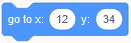
```python
Sprite1.x = 12
Sprite1.y = 34
```
> [!info] Tips
> - Scratch starts co-ordinates from the bottom-left.
> - PyGame Zero starts co-ordinates from the top-left (this is more common).
> - In PyGame Zero increasing the y value moves the character down.
#### Variables
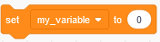
```python
my_variable = 0
```
> [!info] Variable Names
> Most programming languages do not like spaces in variable names.

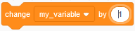

```python
my_variable += 1
```
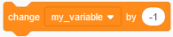
```python
my_variable -= 1
```

```python
screen.draw.text("my_variable: " + str(my_variable), (16, 16))
```
> [!info] Drawing Text
> - `screen.draw.text` - Draw text on the screen
> - `"my_variable: " + str(my_variable)`  - Show the text `my_variable: `, combined with the value of `my_variable`
> - `(16, 16)` show the text at these co-ordinates (x, y)
#### Sounds

```python
sounds.meow.play()
```
#### Events
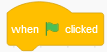
Simply write code outside of functions to achieve this.
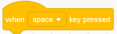
```python
def on_key_down(key):
    if key == keys.SPACE:
        print("Pressed!")
```
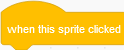
```python
def on_mouse_down(position):
    if Sprite1.collidepoint(position):
        print("Clicked!")
```
>[!info] What does `Sprite1.collidepoint(position)` do?
>`Sprite1.collidepoint(position)` checks to see if the mouse cursor is hovering over the sprite
